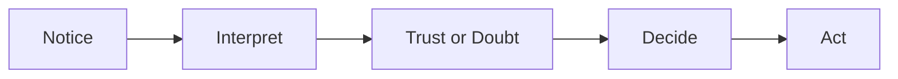

# Persuasion and Human Decision-Making

## What Is Persuasion, Really?

Persuasion is the deliberate use of language, framing, evidence, and emotional appeal to shape what someone pays attention to, how they interpret it, how much they trust it, and what they ultimately do. It shows up everywhere: in advertising, in a friend convincing you to try a restaurant, in a professor explaining why a concept matters, in a résumé cover letter.

It's worth being precise about what persuasion is *not*. Persuasion is not coercion — it doesn't remove someone's choice. It's not manipulation, at least not when done honestly — manipulation typically relies on hiding the true trade-off, exploiting a vulnerability, or misleading someone about facts. Persuasion, at its best, gives someone real information and a real reason, and lets them decide. The line gets blurry in practice, which is exactly why this chapter spends time on ethics, not just technique.

## Cialdini's Principles of Influence

Psychologist Robert Cialdini identified several core principles that reliably influence human decisions. They are widely used — and widely studied — because they map onto real patterns in how people process information under normal, everyday conditions.

- **Reciprocity** — people feel obligated to return a favor. A free sample or a helpful piece of content creates a mild sense of debt.
- **Commitment and Consistency** — once someone takes a small step (signing up, saying yes to something small), they're more likely to follow through with something bigger that aligns with that first step.
- **Social Proof** — people look to others' behavior to decide what's correct or desirable, especially under uncertainty ("bestseller," "10,000 five-star reviews").
- **Authority** — people give more weight to information from a credible, qualified, or official-seeming source.
- **Liking** — people are more easily persuaded by people or brands they find likable, similar to themselves, or attractive in some way.
- **Scarcity** — people value things more when they appear limited, rare, or time-constrained ("only 3 left," "sale ends tonight").

## Two More Ideas Worth Knowing

**Loss Aversion (Behavioral Economics)** — research in behavioral economics has shown that people generally feel the pain of losing something more strongly than the pleasure of gaining something of equal value. This is why messaging framed around *avoiding* a loss ("don't miss out," "stop wasting money on X") often lands harder than messaging framed purely around gain.

**The Rhetorical Triangle (Classical Rhetoric)** — going back to Aristotle, persuasive communication is often described as balancing three appeals: **ethos** (credibility of the speaker), **pathos** (emotional appeal), and **logos** (logical argument or evidence). A message that leans entirely on one — for example, all emotion, no evidence — tends to feel manipulative or hollow, while a balance of the three tends to feel trustworthy.

## Principle → Mechanism → Ethical Use → Misuse Risk

| Principle | Mechanism | Ethical Use | Misuse Risk |
|---|---|---|---|
| Reciprocity | Creates a felt obligation after receiving something | Offering a genuinely useful free sample or resource | Manufacturing a fake sense of obligation |
| Commitment & Consistency | Small yes leads to bigger yes | Letting someone opt into something gradually and honestly | Trapping someone into escalating commitments |
| Social Proof | People copy others under uncertainty | Sharing real reviews or real usage data | Fabricating reviews or inflating numbers |
| Authority | Credible sources are trusted more | Citing a real, relevant expert or credential | Borrowing false or irrelevant authority |
| Liking | Trust increases with likability/similarity | Genuine, relatable communication | Fake friendliness to lower someone's guard |
| Scarcity | Limited things feel more valuable | Accurately communicating real limited supply | Fabricating fake urgency or fake limits |
| Loss Aversion | Losses feel worse than equivalent gains feel good | Honestly highlighting a real cost of inaction | Inventing a loss that doesn't actually exist |

## A Simple Decision Journey

Every persuasive message is trying to move someone through this journey — first getting noticed, then being interpreted the way the communicator intends, then earning enough trust to be believed, and finally prompting a decision and an action.

## The White T-Shirt Example

Take a plain white cotton t-shirt — no logo, no story, nothing distinctive. Now watch what happens when different principles are applied to the exact same shirt:

- **"200 washes, tested. The last white tee you'll buy twice."** — this uses social proof (testing implies verified use) and loss aversion (stop wasting money re-buying shirts).
- **"Only 300 made this season, cut in Portugal."** — this uses scarcity and authority (origin as a credibility signal).
- **"Buy one, and one is donated."** — this uses reciprocity, reframed as the customer's own generosity rather than the brand's.

The shirt never changes. What changes is which psychological lever the message pulls.

## Questions to Ask Before Trying to Persuade

- Is what I'm claiming actually true, or just technically not false?
- Would this message still feel fair if the audience knew exactly which technique I was using?
- Am I giving someone a real reason to decide, or am I trying to bypass their reasoning entirely?
- Who could be harmed if this message worked *too* well?

## Explore Further

If you want to go deeper on this topic, try searching for:
- "Cialdini principles of influence" for the original research and later critiques
- "loss aversion behavioral economics" for foundational work by Kahneman and Tversky
- "rhetorical triangle ethos pathos logos" for the classical rhetoric background

## What You Should Remember

Persuasion is not inherently dishonest — it's a set of tools for helping someone notice, understand, trust, and decide. The same techniques that build genuine trust can also be misused to manipulate, and the difference usually comes down to one question: is the person being given real information and a real choice, or not?