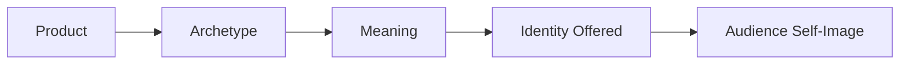

# Brand Archetypes and Meaning

## Archetypes as a Branding Framework

A brand archetype is a recognizable narrative pattern — a familiar "character" that a brand takes on so an audience can immediately sense what it stands for. The idea borrows loosely from Carl Jung's work on archetypes in psychology, but in branding it's used as a **practical framework**, not a scientific model of the human mind.

Archetypes work because humans are pattern-recognizers. We've absorbed thousands of stories — myths, movies, ads — and we intuitively recognize a "wise mentor" character or a "rebellious outsider" character within seconds. Brands borrow these patterns so a product can communicate identity almost instantly, without a customer having to read a paragraph of explanation.

## Archetypes Are Not Destiny

It's important to be careful here: archetypes are **generalized cultural and narrative patterns**, not rigid categories of human personality, and definitely not a diagnostic tool for judging real people. A real brand — like a real person — usually blends tendencies from more than one archetype rather than fitting neatly into a single box. Cultural context also matters: an archetype that reads as "rebellious" in one culture or era might read as simply "normal" in another.

Treat archetypes the way you'd treat a strong starting sketch, not a permanent label. They're most useful as a starting question — *"which of these patterns fits what we're trying to say?"* — not as a box to lock a brand into forever.

## A Useful Set of Common Archetypes

| Archetype | Core Desire | Example Feeling It Sells |
|---|---|---|
| Explorer | Freedom, discovery | "Go find what's out there" |
| Sage | Truth, understanding | "Know more than you did" |
| Creator | Self-expression, originality | "Make something that didn't exist" |
| Ruler | Control, status | "Be in charge, be respected" |
| Caregiver | Protection, service | "Take care of someone" |
| Rebel | Disruption, liberation | "Break the rule that shouldn't exist" |
| Hero | Mastery, courage | "Overcome the hard thing" |
| Everyperson | Belonging, practicality | "Fit in, be reasonable" |
| Innocent | Simplicity, optimism | "Keep it simple and good" |
| Jester | Joy, irreverence | "Don't take this so seriously" |
| Lover | Intimacy, desire | "Feel wanted, feel close" |
| Magician | Transformation | "Change your situation" |

## The Practical Question

Every archetype choice really comes down to one practical question:

> **What does the audience get to feel, imagine, or become by choosing this brand?**

A product doesn't just get bought for its function — it gets bought partly for the identity it lets the buyer step into, even briefly. That's the actual "meaning" a brand archetype is selling.

## Product → Meaning → Identity → Audience

The physical product is just the starting point. The archetype attaches a meaning to it, that meaning offers the customer an identity to try on, and the customer says yes when that identity matches — or flatters — their own self-image.

## The White T-Shirt, Three Ways

The exact same plain white t-shirt, positioned through three different archetypes:

**1. The Explorer**
> "Built for wherever the day takes you. No plan, no problem."

The shirt is framed as gear for spontaneity and freedom — worn while traveling, hiking, wandering. The customer isn't buying fabric; they're buying a small piece of "I go where I want."

**2. The Sage**
> "Engineered from a single, well-understood fiber. No noise, no gimmicks — just a shirt that does exactly what it claims."

The shirt is framed around clarity and honesty — appealing to a customer who values understanding over hype. The identity on offer is "I make informed choices."

**3. The Caregiver**
> "One shirt. One shirt given to someone who needed one."

The shirt is framed as an act of care extended outward. The customer isn't just buying a garment; they're buying a small act of generosity they get to feel good about.

Same cotton, same cut — three completely different reasons to buy it.

## Questions to Ask When Choosing an Archetype

- What does our audience already want to feel or become?
- Does this archetype match what the product can actually deliver, or does it overpromise?
- Would this archetype still feel honest if a skeptical customer looked closely?
- Are we choosing this archetype because it's authentic to the brand, or just because it's trendy?

## Explore Further

If you'd like to go deeper, try searching for:
- "Carl Jung archetypes" for the original psychological concept branding borrows from
- "brand archetype marketing framework" for how the concept is applied commercially
- "Jennifer Aaker brand personality dimensions" for a related, research-based model of brand identity

## What You Should Remember

An archetype isn't a costume a brand puts on — it's a shortcut that lets a customer instantly recognize what a brand values and what identity it's offering them. The same product can be framed through completely different archetypes, and none of the physical product needs to change: what changes is the story about who you become by choosing it.
