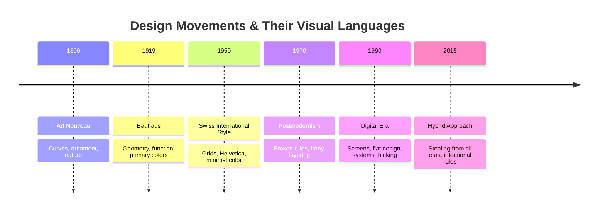

# Design Language: How Things Should Look

## What Is Design Language?

Design language is the set of visual rules, principles, and choices that make something look and feel like *itself*.

It's not decoration. It's communication. It's the visual DNA of a brand or product—the consistent system that says: "This is ours. You'll recognize it again."

When you see the Apple logo, you know what to expect: clean, minimal, intentional. When you see Supreme's box logo, you know: bold, streetwear, subversive. When you see IKEA's typeface and layout, you know: democratic, accessible, Scandinavian.

These are design languages. And they work because they're *consistent* and *intentional*.

---

## A Brief History: From Art Movements to Brand

### Art Nouveau (1890–1910)
Ornament, nature, curves, sensuality. Design was decorative—it celebrated the handmade, the organic, the emotional.

**Visual markers:** Flowing lines, botanical motifs, rich colors, asymmetry

**Philosophy:** "Art should be everywhere, not just in museums"

---

### Bauhaus (1919–1933)
The revolution. "Form follows function." Geometry, primary colors, sans-serif type, the grid.

Walter Gropius and the Bauhaus school married art and industry. They asked: *How do we make beautiful things that work?* And they answered with:
- Geometric abstraction
- Primary colors + black, white, gray
- Sans-serif typefaces (Futura, Gill Sans)
- Modularity and repetition
- Rejection of ornament

**Visual markers:** Clean lines, geometric shapes, functional beauty

**Philosophy:** "Good design solves problems. It doesn't decorate them."

---

### Swiss International Style (1950s–1970s)
The most influential design language of the modern era. Switzerland, precision, grids, hierarchy, clarity.

Josef Müller-Brockmann and grid systems. The idea: if you follow the grid, everything will align. If everything aligns, information is clear. If information is clear, the design is successful.

**Visual markers:**
- Invisible grids (4, 8, 12, 16-column grids)
- Helvetica typeface (the typeface of authority)
- Generous whitespace
- Asymmetrical balance
- Black, white, and one accent color
- Photography as information (not decoration)

**Philosophy:** "Design should be invisible. The message, not the designer, should be seen."

The Swiss style became the language of authority: corporate reports, government documents, museums, tech companies.

---

### Postmodernism (1970s–1990s)
The reaction. "Rules are meant to be broken."

If Swiss style was purity, postmodernism was pluralism. Mixing typefaces. Clashing colors. Irony. Layers. Decoration *as* content.

Designers like David Carson, Paula Scher, and the Memphis design group said: Why should design be invisible? Why can't it be playful, messy, full of personality?

**Visual markers:**
- Multiple typefaces colliding
- Bright, unexpected colors
- Grids broken intentionally
- Visible imperfection
- Decoration and ornament celebrated
- Collage and layering
- Irony and humor

**Philosophy:** "Design can be fun. It doesn't have to be efficient. It can be human."

---

### Digital Era (1990s–2010s)
Screens changed everything. Suddenly designers had to think about:
- How type renders on low-resolution screens
- How to organize information architecture
- Animation and interaction as design
- Responsive design (same design across different sizes)
- Accessibility (color blindness, screen readers, etc.)

This led to:
- Cleaner typefaces designed for screens
- Flatter design (drop shadows became un-cool)
- Minimalism (again, but for a reason: screens are small)
- Systematic design thinking (design systems, component libraries)

**Visual markers:**
- Helvetica and "safe" sans-serifs (then custom typefaces)
- Flat color (no gradients)
- Large typography
- Generous padding and whitespace
- Icons as visual language
- Modular, repeatable components

**Philosophy:** "Design is a system. Build components that scale."

---

### Hybrid (2015–Now)
All of the above at once. Modernism, postmodernism, playfulness, order. Brands mix Swiss geometry with Memphis color. We steal from every era.

The rule now: **Pick your rules intentionally, then follow them consistently.**

---

## The Tension: Order vs. Disruption

Every design language sits on a spectrum:

| | Modernist (Swiss) | Balanced | Postmodern (Disruptive) |
|---|---|---|---|
| **Goal** | Clarity | Clarity + Personality | Personality + Provocation |
| **Typeface** | One sans-serif (Helvetica) | One or two typefaces | Many typefaces, mixed weights |
| **Color** | Minimal (2–3) | Balanced (3–5) | Rich, unexpected (5+) |
| **Grid** | Strict | Mostly followed | Broken for effect |
| **Whitespace** | Maximum | Generous | Minimal, filled |
| **Ornament** | None | Subtle | Visible, layered |
| **Mood** | Authority, clarity, efficiency | Accessible, modern | Personality, irreverence, human |
| **Brand Examples** | Apple, Tesla, Google | Nike, Medium, Stripe | Supreme, Dior, Gucci, Vice |

Neither is "better." It depends on what you're trying to say and to whom.

---

## The Timeline: How Design Language Evolved

---

## How to Read a Design Language

When you encounter a design, ask:

1. **What era does this reference?** (Swiss? Postmodern? Hybrid?)
2. **What typefaces are used?** (How many? What message do they send?)
3. **What colors?** (Minimal or rich? Analogous or contrasting?)
4. **How is whitespace used?** (Generous or filled?)
5. **Is the grid visible or hidden?** (Strict order or intentional chaos?)
6. **What's the mood?** (Authority? Play? Accessibility? Disruption?)
7. **Who does this language invite?** (Who feels "at home" in this aesthetic?)

---

## Museum Research: See It in Person

Design languages are easier to understand when you *see* them. Here are real places where you can study design history:

**The Met (New York)** — Search for "graphic design" or "design collection" in their online collection. Look for Swiss posters and Bauhaus textiles.

**MoMA (New York)** — Search "design" and "graphic design." They have David Carson, Paula Scher, and 100 years of design language.

**Cooper Hewitt (New York)** — Dedicated design museum. Search "20th century design" or "Swiss design."

**V&A Museum (London)** — Vast collection of design across eras. Search "postmodernism" and "contemporary design."

**Bauhaus Archives (Berlin)** — The source. Original Bauhaus posters, typography, everything.

---

## Modernism vs. Postmodernism: The White T-Shirt Debate

How would a **modernist designer** and a **postmodern designer** approach a simple white T-shirt?

**Modernist (Swiss):**
- Single typeface, Helvetica
- Centered, vertically and horizontally
- One-color print (black)
- Minimal text: just the brand name
- Clean, invisible
- The shirt fades away; the wearer is visible

**Postmodern:**
- Multiple typefaces, sizes clashing
- Off-center, tilted, unexpected placement
- Full-color print, layered graphics
- Text that becomes image
- Visible, celebrated
- The shirt *is* the statement

Same shirt. Different languages. Different customer. Different meaning.

---

## What You Should Remember

Design language is not cosmetic. It's *structural*. It's how you organize information, hierarchy, and meaning.

Every consistent visual system tells a story:
- **Modernist design** says: "Trust me. I've done the work. Everything here is intentional."
- **Postmodern design** says: "I'm playful. I don't take myself too seriously. I want to surprise you."
- **Hybrid design** says: "I know the rules. I'm breaking some of them on purpose."

The best design languages are:
1. **Consistent** (you recognize them again)
2. **Intentional** (every choice has a reason)
3. **Appropriate** (they fit the audience and message)
4. **Memorable** (they stick with you)

Your job as a designer is not to invent beauty. It's to create clarity through consistency. Beauty follows.
