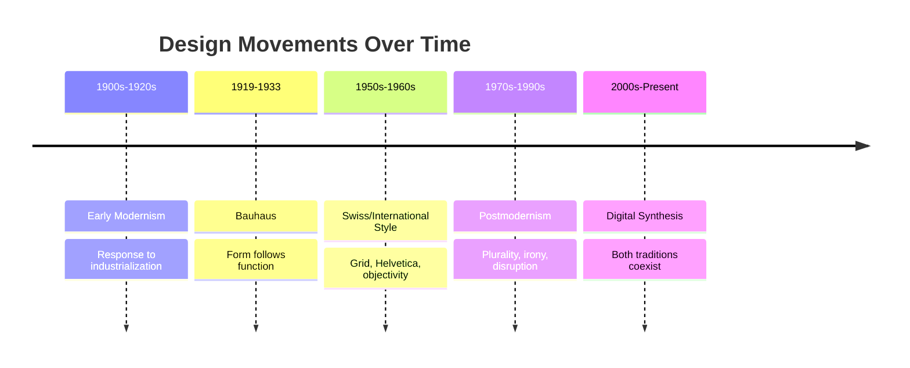

# Modernism, Postmodernism, and Visual Language

## How to Read a Design

Before we go into history, here's a habit worth building: when you look at any design — a poster, a website, a product label — ask yourself three questions. What is being emphasized, and what is being pushed to the background? Is the layout following a strict, visible structure, or is it deliberately breaking one? And does the type and imagery feel restrained, or expressive? Those three questions will carry you through everything in this chapter.

## A Short Path Into Modernism

In the early 20th century, as industrialization reshaped daily life, a generation of designers began asking a new question: if factories could mass-produce objects identically, shouldn't design serve function honestly, rather than disguise machine-made objects as hand-crafted ones? This shift — away from ornament, toward clarity and purpose — is the root of what we now call **modernism**.

## Bauhaus

Founded in Germany in 1919, the Bauhaus school became one of the most influential design institutions of the 20th century. Its core belief was that form should follow function, and that art, craft, and technology should be unified rather than kept separate. Bauhaus design favored geometric shapes, primary colors, and a rejection of decorative excess — the idea that a chair, a teapot, or a poster should look the way it does *because of what it does*, not because of unrelated decoration layered on top.

## Swiss / International Typographic Style

Emerging in the 1950s, largely out of Switzerland, this movement pushed modernist ideas even further into structure and precision. Its hallmarks:

- **The grid** — content organized into a strict, mathematical structure
- **Sans-serif typography** (Helvetica being the most famous example) — clean, neutral, legible
- **Objectivity** — the idea that a well-designed layout communicates the same way to everyone, regardless of personal taste

This style aimed for a kind of visual universality: information presented so clearly and neutrally that it could, in theory, be understood the same way by anyone, anywhere.

## Modernist Principles, Summarized

- **Grid** — an underlying structural system
- **Hierarchy** — clear visual signals for what matters most
- **Clarity** — nothing left ambiguous
- **Reduction** — remove anything not essential
- **Function** — form justified by purpose, not decoration

## The Postmodern Reaction

By the 1970s and 80s, a new generation of designers began pushing back against modernism's confidence. If modernism claimed one universal, "correct" way to communicate clearly, postmodern designers asked: correct according to whom? Whose values count as "neutral"?

Postmodern design embraced:

- **Plurality** — many valid styles, not one universal answer
- **Irony** — knowingly playing with or subverting expectations
- **Disruption** — breaking the grid on purpose
- **Quotation** — borrowing and remixing styles from history
- **Expressive typography** — type as decoration and emotion, not just neutral information delivery

Where modernism said "there is one clear way to say this," postmodernism said "there are many ways to say this, and the choice itself carries meaning."

## The Underlying Tensions

| Tension | Modernist Side | Postmodern Side |
|---|---|---|
| Order vs. Disruption | Predictable structure | Deliberately broken structure |
| Universality vs. Identity | One style for everyone | Style as personal/cultural expression |
| Clarity vs. Expression | Say it plainly | Say it with feeling and flair |
| Grid vs. Anti-Grid | Strict alignment | Intentional misalignment |
| Restraint vs. Abundance | Less is more | More can be more, on purpose |
| Function vs. Irony | Form follows purpose | Form can wink at the audience |

## A Design History Timeline

## These Tensions Live On in Digital Design

Open any modern website or app and you'll see both traditions still competing. A banking app or productivity tool tends to lean modernist — clean grids, restrained color, high legibility, because trust and clarity matter more than personality. A streetwear brand's website or a music festival's promotional page tends to lean postmodern — chaotic layouts, clashing type, intentional visual noise, because standing out and feeling alive matters more than neutrality.

Neither approach is simply "correct." The right choice depends entirely on what the design is trying to communicate, and to whom.

## Back to the White T-Shirt

Take the same plain white t-shirt one more time. A **modernist presentation** — clean product photography, generous white space, one sans-serif line of copy, a grid-aligned layout — makes the shirt feel engineered, trustworthy, almost clinical. A **postmodern presentation** — clashing colors, hand-drawn type, an intentionally "messy" collage layout — makes the exact same shirt feel rebellious, artistic, unconcerned with convention.

The cotton hasn't changed at all. The visual language alone tells the customer whether this is a shirt for someone who values precision or someone who values personality.

## Museum Research

To see real, verified examples of these movements, search major museum and institutional collections rather than relying on random image searches, which often include reproductions or misattributed work. Good places to start:

- The Metropolitan Museum of Art (metmuseum.org) — search "Bauhaus" or "modernist design"
- MoMA (moma.org) — search "Bauhaus," "Swiss design," or "graphic design collection"
- Cooper Hewitt, Smithsonian Design Museum (cooperhewitt.org) — search "modernist typography"
- Victoria and Albert Museum (vam.ac.uk) — search "postmodern design" or "graphic design history"
- Bauhaus-Archiv Berlin (bauhaus.de) — the Bauhaus school's own archive

Search these collections yourself and verify the specific objects, dates, and designers you find — don't take any single source's caption at face value without cross-checking.

## What You Should Remember

Modernism and postmodernism aren't a story of one style replacing another — they're an ongoing argument about whether design should aim for one universal clarity or embrace many competing voices. That argument never actually ended; it just keeps showing up in new form, every time you open an app or walk past a poster.
