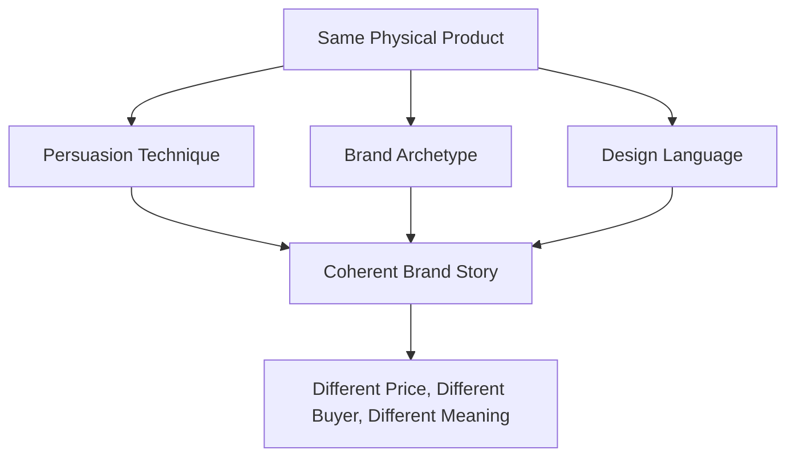

# The White T-Shirt: One Product, Three Stories

## The Setup

Take the most ordinary object you can find: a plain white cotton t-shirt. No logo, no pattern, no color story. Just fabric and thread.

Now imagine three different brands need to sell this exact same shirt. Same cotton, same cut, same factory. What changes isn't the product — it's the *story* wrapped around it. This chapter walks through how persuasion techniques, brand archetypes, and design language combine to turn one plain shirt into three completely different offers.

## Lens 1: Persuasion

**Brand A — The Basic Essentials Co.**
> "The last white tee you'll ever need to buy twice. 200 washes, tested. $12."

This uses **social proof** and **loss aversion**: nobody wants to keep re-buying shirts that fall apart, and the specific number (200 washes) makes the durability claim feel tested rather than vague.

**Brand B — Atelier Blanc**
> "Handcut from Portuguese combed cotton. 300 pieces made this season. $95."

This leans on **scarcity** and **authority**: a limited run and a specific origin story (Portuguese cotton) signal exclusivity and craftsmanship, which justifies the price gap.

**Brand C — Common Thread**
> "One shirt. One shirt bought for someone who needs one. $28."

This uses **reciprocity and identity-based giving**: the buyer isn't just purchasing a shirt, they're completing a small act of generosity, which reframes the price as a shared cost rather than a personal expense.

## Lens 2: Brand Archetypes

| Brand | Archetype | Why |
|---|---|---|
| Basic Essentials Co. | **The Everyman** | Speaks to practicality, no pretense, "just works" |
| Atelier Blanc | **The Creator / Ruler** | Craftsmanship and exclusivity signal mastery and status |
| Common Thread | **The Caregiver** | Frames the purchase as an act of care for someone else |

The archetype isn't decoration — it's the lens that decides which persuasion techniques even make sense. An Everyman brand using scarcity language ("only 300 made!") would feel dishonest, because scarcity contradicts "for everyone." A Caregiver brand leaning on status ("wear what the elite wear") would break trust the same way.

## Lens 3: Design Language

**Basic Essentials Co.** — Sans-serif, all lowercase, high-contrast black on white. Every visual choice says "no frills, just facts." Packaging is a simple cardboard box with a barcode-style label.

**Atelier Blanc** — Serif type, generous whitespace, muted grey and cream palette. The design *slows the shopper down*, because luxury shopping is meant to feel unhurried. Packaging is tissue paper and a wax seal.

**Common Thread** — Warm, rounded sans-serif, soft earth tones, small hand-drawn icons. The design feels approachable and human, reinforcing the caregiving story. Packaging includes a small card naming who received the "paired" shirt.

## The Pattern

None of these three layers works alone. A scarcity claim without a matching Ruler/Creator archetype feels like a gimmick. A Caregiver archetype without warm design language feels hollow. A discount price without Everyman design language feels like a hidden defect. The layers have to agree with each other, or the shopper senses the mismatch even if they can't name why.

## What You Should Remember

The t-shirt never changes. What changes is which lens the brand chooses — and once that lens is chosen, persuasion, archetype, and design language all have to point the same direction. That alignment, not the product itself, is what the customer is actually buying.
