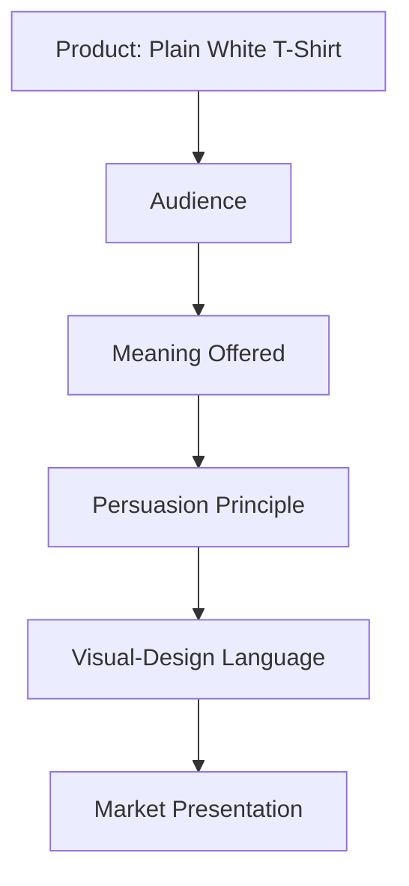

# Selling the Same White T-Shirt Four Different Ways

## The Setup

The physical product never changes: an ordinary, high-quality, plain white cotton t-shirt. No logo, no pattern. What follows are four radically different market presentations of that exact same shirt — each one inviting the customer to buy a different *meaning*, not a different shirt.

---

## Concept 1: TrailForm

**Audience:** Outdoor-minded young adults who value flexibility and spontaneity over routine.

**Brand Archetype:** Explorer

**Persuasion Principles:** Aspiration and identity-based appeal — the shirt is framed as gear for a life in motion, not as a purchase decision to deliberate over. A light use of social proof ("worn on six continents") reinforces the lifestyle claim without pressuring urgency.

**Visual-Design Language:** Rugged, sun-faded photography; muted earth tones; a slightly worn, textured logo mark suggesting use rather than newness.

**Headline:** "One shirt. Every direction."

**Short Product Story:** Built by people who kept losing good shirts to bad trips — torn on gear, faded by sun, stretched out of shape. TrailForm set out to make one shirt durable and simple enough to stop thinking about, so the only thing left to plan is where you're going next.

**Imagery Direction:** Candid, outdoor lifestyle photography — trailheads, campsites, cliffsides — never a studio backdrop.

**What Meaning Is Actually Being Bought:** Not durability itself, but the *identity* of being someone spontaneous and unbothered by planning — the shirt is a prop for that self-image.

**Ethical Concern:** Romanticizing a rugged, adventurous lifestyle can imply a level of freedom (time, money, mobility) that isn't accessible to everyone, subtly excluding audiences who can't match the fantasy.

---

## Concept 2: Neutral Standard

**Audience:** Design-conscious professionals who value precision and dislike marketing hype.

**Brand Archetype:** Sage

**Persuasion Principles:** Authority through specificity and restraint — precise technical claims (fabric weight, fiber source) stand in for emotional appeal, signaling that the brand trusts the customer to evaluate facts rather than being persuaded by feeling.

**Visual-Design Language:** Swiss/International Typographic Style — strict grid layout, generous white space, a single neutral sans-serif typeface, monochrome product photography with no styling or props.

**Headline:** "190 grams. One fiber. No noise."

**Short Product Story:** Neutral Standard exists because most "basics" brands over-explain a simple product. This shirt is described the way an engineer would describe it — exact weight, exact fiber, exact fit — because the people who buy it don't want a story. They want to know precisely what they're getting.

**Imagery Direction:** Flat, evenly lit studio photography on a plain background; no models with exaggerated poses, no lifestyle staging.

**What Meaning Is Actually Being Bought:** The feeling of being a discerning, informed buyer who sees through marketing — the restraint itself is the persuasive device.

**Ethical Concern:** Presenting a product as purely "neutral" or "objective" can itself be a persuasion technique — dressing up a subjective aesthetic choice (minimalism) as though it were simply "the facts," which can mislead customers into thinking they're avoiding marketing when they're not.

---

## Concept 3: RIOT BASIC

**Audience:** Young, culturally plugged-in consumers drawn to streetwear and anti-establishment aesthetics.

**Brand Archetype:** Rebel

**Persuasion Principles:** Scarcity and social proof combined with irony — the product is positioned as "the shirt everyone pretends not to want," using reverse psychology and cultural signaling rather than direct claims about the product itself.

**Visual-Design Language:** Postmodern and disruptive — clashing type sizes, intentionally misaligned layout, collage-style imagery, deliberately "unfinished" or glitchy graphic elements.

**Headline:** "The blank shirt everyone's copying."

**Short Product Story:** RIOT BASIC started as a joke: selling literally nothing (a plain shirt) as though it were the most exclusive item of the season. The joke became the point — proving that meaning, not fabric, is what actually drives demand.

**Imagery Direction:** Chaotic street-style photography, harsh flash, cropped and overlapping images, zines-style layout.

**What Meaning Is Actually Being Bought:** In-group cultural status — being someone "in on the joke" of buying a plain shirt ironically, which paradoxically becomes its own status marker.

**Ethical Concern:** Manufactured scarcity ("limited drop") on a genuinely unlimited product (a plain shirt) risks misleading customers about real exclusivity, encouraging impulse purchases based on fabricated urgency.

---

## Concept 4: Paired

**Audience:** Socially conscious consumers who want everyday purchases to feel meaningful.

**Brand Archetype:** Caregiver

**Persuasion Principles:** Reciprocity, reframed outward — the customer isn't receiving a favor, they're extending one. This shifts the perceived cost of the purchase from "spending on myself" to "an act of generosity I get to take part in."

**Visual-Design Language:** Warm, approachable, hand-illustrated icons; soft earth tones; simple, friendly typography that feels handwritten rather than corporate.

**Headline:** "One shirt for you. One shirt for someone who needs one."

**Short Product Story:** Paired began with a simple rule: every shirt sold pairs with one given away. The customer never meets the person who receives the second shirt, but they receive a small card naming where it went — turning an ordinary purchase into a small, tangible act of care.

**Imagery Direction:** Warm, human-centered photography; hands, small moments of exchange; never posed or overly polished.

**What Meaning Is Actually Being Bought:** The emotional reward of feeling generous and connected to a larger act of care, layered onto an otherwise ordinary purchase.

**Ethical Concern:** "Buy one, give one" models can obscure whether the giving actually meets a real, well-assessed need, and can risk making the customer's *feeling* of generosity the real product, rather than genuine impact.

---

## Synthesis Table

| Concept | Archetype | Persuasion | Visual Language | Meaning Sold |
|---|---|---|---|---|
| TrailForm | Explorer | Aspiration, light social proof | Rugged, outdoor lifestyle photography | Freedom, spontaneity |
| Neutral Standard | Sage | Authority through specificity | Swiss/modernist grid, restraint | Discernment, being informed |
| RIOT BASIC | Rebel | Manufactured scarcity, irony | Postmodern, disruptive, collage | In-group cultural status |
| Paired | Caregiver | Reframed reciprocity | Warm, hand-illustrated, human | Generosity, connection |

## How It All Combines

Every concept starts from the identical product. What diverges immediately is the audience being targeted, which determines what meaning is worth offering them, which determines which persuasion techniques will actually land, which determines what the design needs to look and feel like. Change any one link in that chain, and the whole presentation has to change with it — that's why a truly modernist visual language could never sell RIOT BASIC's rebellious positioning, and vice versa.

## What You Should Remember

None of these four brands are lying about the physical product — the shirt really is the same. What each one sells is a different answer to "what does this purchase let you become?" The persuasion technique, the archetype, and the visual language all have to agree with each other, or the pitch falls apart the moment a customer looks closely.
