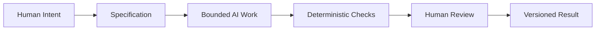

# Synthesis: Using the Three Lenses to Direct AI

## From Branding Framework to Control Framework

The first three chapters introduced three lenses for shaping how a product or message is perceived:

- **Persuasion** helps answer: *what response are we trying to enable?*
- **Archetype** helps answer: *what meaning or identity are we expressing?*
- **Design language** helps answer: *how should that meaning look and feel?*

These three questions don't only apply to branding. They form a useful high-level control framework for directing AI-assisted creative and technical work. When you ask an AI assistant to draft a chapter, write code, or generate a design, you are implicitly making the same three decisions: what outcome you want, what identity or intent should shape it, and how the result should look, feel, or behave. Being explicit about all three — instead of leaving them implicit — is what turns a vague prompt into a bounded, reviewable task.

## Why AI Work Needs a Specification

An AI assistant will confidently produce an answer to almost any prompt, whether or not the prompt was clear. A vague request ("make this chapter better") invites an open-ended, unpredictable result. A bounded request — like the issue prompts used throughout this book — defines the required output, the acceptance criteria, and the constraints up front.

This matters because AI-generated work is *probabilistic*: the same prompt can produce different results on different runs, and a confident-sounding answer is not the same as a correct one. A specification narrows the space of acceptable outputs before generation happens, which makes the result easier to review and easier to trust.

## Why Git Provides Traceability and Recovery

Every chapter in this book was created on its own branch, tied to a specific issue, and merged only after review. This is not bureaucracy for its own sake. Git gives you:

- **Traceability** — every change is tied to a commit, a message, and (via the issue number) a reason
- **Recovery** — if an AI-generated change turns out to be wrong, you can revert to the last known-good commit instead of trying to manually undo it
- **Isolation** — a bad or incomplete AI attempt lives on its own branch and never touches your working `master` until it's reviewed and merged

When AI is generating a meaningful share of your work, this safety net becomes more important, not less. The AI can be wrong quickly; Git lets you recover just as quickly.

## Deterministic Checks vs. Probabilistic Review

Two very different kinds of review happen in this workflow, and it's important not to confuse them.

**Deterministic checks** (like the GitHub Action verifying that all required files exist, that commits reference issues, and that a minimum number of Mermaid diagrams are present) are cheap, repeatable, and give the same answer every time. They are excellent at catching missing requirements, but they cannot tell you whether the content is actually good, accurate, or well-written.

**Probabilistic review** — including an AI assistant reviewing its own or another AI's output — can catch a wider range of issues, including style, clarity, and logical gaps. But it is not guaranteed to be consistent or correct. An AI reviewer can miss real problems or flag non-problems with equal confidence.

Because of this difference, deterministic checks are useful as a fast first pass, but they are not a substitute for a human actually reading the result.

## Why Humans Remain Responsible

No automated check, and no AI reviewer, can be held responsible for judgment, meaning, truthfulness, context, or the final decision to ship something. Only a human can decide whether a chapter actually reflects what they meant to say, whether an example is appropriate for its audience, or whether a claim is actually true rather than merely plausible-sounding.

A useful way to think about this is a **race-car pit-stop**. During a race, the car keeps running lap after lap on its own — that's automation doing its job continuously and cheaply. But at planned intervals, the car comes into the pit for a deliberate, focused human inspection: tires, fuel, brakes, anything the automated telemetry can't fully judge on its own. The race doesn't stop for every lap to be manually inspected — that would be far too slow. But it also never skips the pit stop entirely, because some things only a human, present and paying attention, can catch in time.

AI-assisted work should follow the same rhythm: let bounded, specified tasks run largely on their own, supported by fast deterministic checks — but build in deliberate moments where a human actually stops and looks closely before the work goes any further.

## The Complete Workflow

Each stage exists for a reason: intent without a specification is too vague for AI to act on reliably; AI work without deterministic checks has no fast way to catch missing requirements; deterministic checks without human review can pass technically complete but low-quality or inaccurate work; and none of it is safely reusable or recoverable without version control capturing the result.

## Questions for Next Week

- Where in this practical did the AI's output need the most correction, and why?
- Which parts of the workflow (issue, branch, prompt, commit, merge, GitHub Action) felt most like genuine safety nets, and which felt like overhead?
- If you removed the human review step entirely and trusted only the deterministic checks, what kinds of problems could slip through?

## What You Should Remember

AI can produce fast, confident, plausible-sounding work — but confidence is not the same as correctness. A good workflow doesn't try to eliminate AI's unpredictability; it contains it, with a clear specification going in, fast deterministic checks along the way, and a human decision at the end that nothing else in the process can replace.
