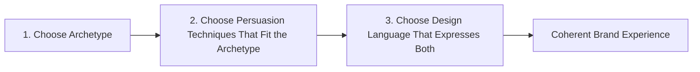
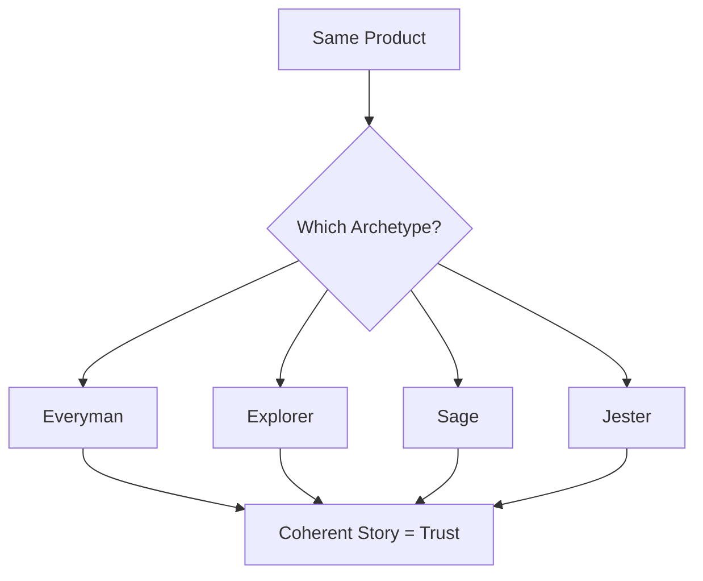

# Synthesis: How the Three Lenses Work Together

## Why This Matters

Across the last four chapters, you've seen three separate lenses — persuasion, brand archetype, and design language — applied to real examples, including one product (the white t-shirt) sold three completely different ways. This final chapter pulls those threads together into one framework you can apply to *any* product or message going forward.

## The Three Lenses, Recapped

1. **Persuasion** — the specific psychological triggers used in the message itself (scarcity, social proof, reciprocity, authority, loss aversion, and others). This is the *sentence-level* layer: what words and claims are chosen.

2. **Brand Archetype** — the underlying character or role the brand plays (Everyman, Creator, Ruler, Caregiver, and others). This is the *personality-level* layer: who is speaking, and what values they represent.

3. **Design Language** — the visual system (typography, color, spacing, imagery) that expresses the brand consistently across every touchpoint. This is the *sensory-level* layer: what it looks and feels like before anyone reads a word.

## Why Order Matters

These layers aren't independent choices — they're dependent on each other, and they work best in a specific order:

If you pick the archetype first, the right persuasion techniques and design choices become obvious. If you pick persuasion techniques first without an archetype, you risk manipulative-feeling messaging that doesn't match how the brand looks or feels. If you pick design first without knowing the archetype, you get a good-looking brand that doesn't say anything specific.

## Applying the Framework: A New Example

Let's apply this to something outside the t-shirt case study: a reusable water bottle.

**If the archetype is the Explorer** (independence, adventure, discovery):
- *Persuasion*: "Built for the trail you haven't found yet" (aspiration, not scarcity)
- *Design language*: Rugged textures, muted earth tones, topographic map motifs

**If the archetype is the Sage** (knowledge, clarity, evidence):
- *Persuasion*: "The only bottle tested against 12 filtration standards" (authority, data-backed claims)
- *Design language*: Clean lines, clinical white and blue palette, spec-sheet-style labeling

**If the archetype is the Jester** (fun, irreverence, surprise):
- *Persuasion*: "Finally, a water bottle that doesn't take itself so seriously" (humor, pattern interrupt)
- *Design language*: Bright colors, playful illustrations, unexpected shapes

Same bottle. Three completely different products in the customer's mind — because all three layers moved together.

## The Core Takeaway

Good branding isn't about picking the cleverest persuasion technique or the prettiest design. It's about **alignment**: choosing one clear archetype, then making sure every persuasion technique and every visual choice reinforces that same character. When all three lenses agree, the customer doesn't consciously notice any of them — they just feel like they understand who the brand is and whether it's for them. That feeling of coherence, more than any single tactic, is what actually builds trust and drives a purchase.

## Closing Note

Across this book, the plain white t-shirt was never really the subject. It was a controlled example — a way to isolate how much of what we call "branding" has nothing to do with the physical product at all. The same principle applies far beyond t-shirts: to software, to services, to a personal resume, even to how you present an idea in a meeting. The object stays the same. The story around it is the actual product.
